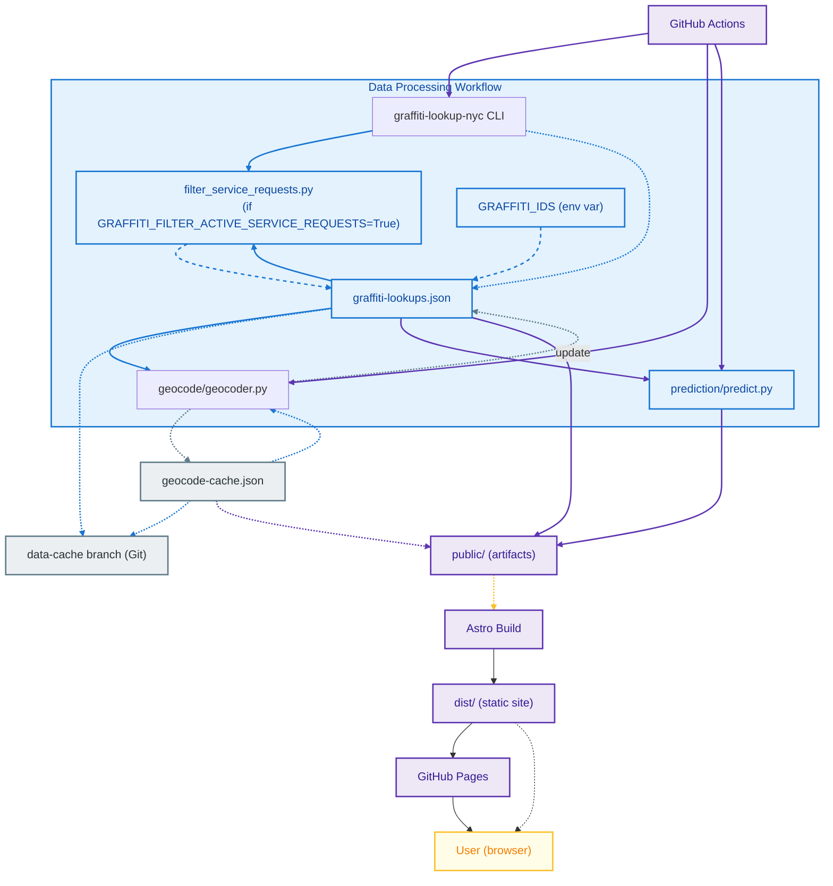

# Graffiti Lookup NYC Web

An interactive web application to explore graffiti removal requests across New York City. Built with Astro and Vue, featuring a side-by-side list and map view.

## Features

- **Interactive Map** - View graffiti reports on a Leaflet map with CARTO Voyager basemaps
- **Search & Filter** - Search by ID or address, filter by status with dropdown
- **Click to Highlight** - Click markers or list items to sync selection between views
- **Live Map Updates** - Map markers update in real-time as you filter or scroll
- **Daily Updates** - Data refreshed automatically via GitHub Actions using [graffiti-lookup-nyc](https://pypi.org/project/graffiti-lookup-nyc/)
- **Geocoded Addresses** - Addresses automatically converted to map coordinates with caching
- **Mobile Responsive** - Optimized for mobile viewports with side-by-side filters

## Tech Stack

- [Astro](https://astro.build/) - Static site generator
- [Vue 3](https://vuejs.org/) - Interactive components with Composition API
- [Leaflet](https://leafletjs.com/) - Map library with [CARTO Voyager](https://carto.com/) tiles
- [geopy](https://geopy.readthedocs.io/) - Address geocoding via Nominatim
- [graffiti-lookup-nyc](https://pypi.org/project/graffiti-lookup-nyc/) - NYC 311 graffiti data CLI

## Local Development

### Prerequisites

- Node.js 20+ (see `.nvmrc`)
- Python 3.12+ (for geocoding script)

### Setup

```bash
# Install Node dependencies
npm install

# Start development server
npm run dev
```

The site will be available at `http://localhost:4321/graffiti-lookup-nyc-web/`

### Generating Data Locally

To generate graffiti data and geocode addresses locally:

```bash
# Install Python dependencies
pip install -r graffiti_data_pipeline/requirements.txt

# Generate graffiti data (replace with your IDs)
graffiti-lookup-nyc --ids "G258700,G258801,G258900" --file-path public/graffiti-lookups.json --file-type json

# Geocode addresses
python -m graffiti_data_pipeline.geocode
```

## Deployment


## Deployment

This project is configured for automated deployment to GitHub Pages using the latest recommended GitHub Actions workflow.

### Automatic Deployment

The GitHub Actions workflow (`.github/workflows/build-and-deploy.yml`) runs daily at 12am EST and:

1. Fetches the latest graffiti data using the `graffiti-lookup-nyc` CLI
2. Geocodes new addresses
3. Builds the Astro site
4. Deploys to GitHub Pages using the official deployment actions

#### Key Workflow Features

- Uses `actions/configure-pages@v5` to set up the Pages environment (required by GitHub for secure and reliable deployments)
- Uses `actions/upload-pages-artifact@v3` and `actions/deploy-pages@v4` for artifact upload and deployment
- The `deploy` job includes:
  ```yaml
  environment:
    name: github-pages
    url: ${{ steps.deployment.outputs.page_url }}
  ```
  This ensures the deployment environment is correctly linked in the GitHub UI.

### Required Setup

1. **Enable GitHub Pages** in your repository settings:
   - Go to Settings → Pages
   - Set Source to "GitHub Actions"

2. **Add Repository Variable**:
   - Go to Settings → Secrets and variables → Actions → Variables
   - Add a variable named `GRAFFITI_IDS` with comma-separated graffiti lookup IDs (e.g., `G258700,G258801,G258900`)

### Manual Deployment

You can trigger a manual deployment from the Actions tab by running the "Build and Deploy" workflow.

## Project Structure

```
├── .github/
│   └── workflows/
│       ├── build-and-deploy.yml  # Daily data fetch & deploy
│       ├── codeql.yml            # Security analysis
│       ├── lint-js.yml           # ESLint for Vue/Astro
│       ├── lint-python.yml       # Black & flake8 for Python
│       └── test.yml              # Python tests with coverage
├── graffiti_data_pipeline/
│   ├── __init__.py
│   ├── __main__.py                # CLI entry point
│   ├── config.py                  # Configuration constants
│   ├── filter_service_requests.py # Filtering logic for service requests
│   ├── logger.py                  # Logging setup
│   ├── requirements.txt           # Python dependencies
│   ├── requirements-dev.txt       # Dev dependencies (pytest, etc.)
│   ├── geocode/
│   │   ├── __init__.py
│   │   ├── __main__.py            # Geocoding CLI entry point
│   │   ├── geocoder.py            # Geocoding logic
│   │   ├── sanitize.py            # Address normalization
│   ├── prediction/
│   │   ├── __init__.py
│   │   ├── features.py            # Feature engineering
│   │   ├── model.py               # ML model training & inference
│   │   ├── predict.py             # Prediction pipeline CLI
│   │   ├── request.py             # Service request data model
│   ├── storages/
│   │   ├── __init__.py
│   │   ├── google_sheets.py       # Google Sheets integration
│   │   ├── json.py                # JSON file storage
│   ├── tests/
│   │   ├── __init__.py
│   │   ├── test_filter_service_requests.py
│   │   ├── geocode/
│   │   │   ├── test_geocoder.py
│   │   │   ├── test_main.py
│   │   │   ├── test_sanitize.py
│   │   ├── prediction/
│   │   │   ├── test_features.py
│   │   │   ├── test_model.py
│   │   │   ├── test_predict.py
│   │   │   ├── test_request.py
│   │   ├── storages/
│   │   │   ├── test_google_sheets.py
│   │   │   ├── test_json_file.py
├── public/
│   ├── geocode-cache.json        # Cached geocoding results
│   └── graffiti-lookups.json     # Generated graffiti data
├── src/
│   ├── components/
│   │   ├── ListItem.vue          # Individual report card
│   │   ├── ListView.vue          # Scrollable list with search & filter
│   │   ├── MapView.vue           # Leaflet map with dynamic markers
│   │   ├── SearchBar.vue         # Reusable search input component
│   │   ├── StatusChip.vue        # Status badge with color coding
│   │   └── StatusFilter.vue      # Reusable status dropdown filter
│   ├── layouts/
│   │   └── Layout.astro          # Base HTML layout (100dvh viewport)
│   └── pages/
│       └── index.astro           # Main page with flex layout
├── astro.config.mjs              # Astro configuration
├── eslint.config.js              # ESLint configuration
├── setup.cfg                     # Python tool config (flake8, pytest)
└── package.json
```
# Graffiti Data Pipeline

This package provides a modular pipeline for fetching, filtering, geocoding, predicting, and storing NYC graffiti removal service requests. It is designed for integration with the Graffiti Lookup NYC web application and for standalone data processing.

## Pipeline Usage

### Install dependencies

```bash
pip install -r graffiti_data_pipeline/requirements.txt
```

### Run the pipeline

#### Fetch & Filter Service Requests

```bash
python -m graffiti_data_pipeline.filter_service_requests  # Custom CLI entry point
```

#### Geocode Addresses

```bash
python -m graffiti_data_pipeline.geocode   # Geocoding pipeline
```

#### Predict Graffiti Recurrence & Cleaning

```bash
python -m graffiti_data_pipeline.prediction.predict
```

### Storage

- JSON file storage is handled via `storages/json.py`.
- Google Sheets integration is available via `storages/google_sheets.py`.

### Testing

```bash
pytest graffiti_data_pipeline/tests
```

## Key Pipeline Modules

- **config.py**: Centralized configuration (constants, file paths, status keywords)
- **filter_service_requests.py**: Filtering logic for active/completed requests
- **geocode/**: Geocoding and address normalization
- **prediction/**: Feature engineering, ML model training, prediction
- **storages/**: Data storage abstractions (JSON, Google Sheets)
- **tests/**: Unit tests for all modules

## Example Pipeline Workflow

1. Fetch raw graffiti service requests (via CLI or API)
2. Filter requests for active/completed status
3. Geocode addresses and cache results
4. Engineer features and train ML models
5. Predict recurrence, cleaning likelihood, and time-to-next-update
6. Store results in JSON or Google Sheets

## Architecture Diagram

Below is a high level architecture diagram showing the main data flow and core components:




**Legend:**
- **Data Acquisition & Processing (Python):** CLI and scripts for fetching, filtering, and geocoding graffiti data. If the environment variable `GRAFFITI_FILTER_ACTIVE_SERVICE_REQUESTS` is `True`, `filter_service_requests.py` filters the graffiti-lookups.json; otherwise, IDs are taken from the `GRAFFITI_IDS` env var.
- **Data Caching & Reuse:** All data artifacts are cached in a dedicated branch (`data-cache`) to store geocoding results and graffiti lookup data. `geocode-cache.json` is only used by the GitHub Action for geocoding, not by the Astro build.
- **Build & Deployment (CI/CD):** GitHub Actions orchestrates the pipeline, builds the static site, and deploys to GitHub Pages.
- **Frontend (Astro + Vue):** Static site served to users, with all data precomputed and embedded.


> **Note:**
> The `data-cache` branch is a persistent cache for both geocode results and graffiti lookup data. `geocode-cache.json` is only used by the GitHub Action to avoid redundant geocoding, and is not consumed by the Astro build. The same data is available for the Astro build and for filtering operations (e.g., in `filter_service_requests`).
>
> The workflow uses `filter_service_requests.py` to filter graffiti-lookups.json only if the environment variable `GRAFFITI_FILTER_ACTIVE_SERVICE_REQUESTS` is set to `True`. Otherwise, the IDs are taken from the `GRAFFITI_IDS` environment variable.

## License

MIT
